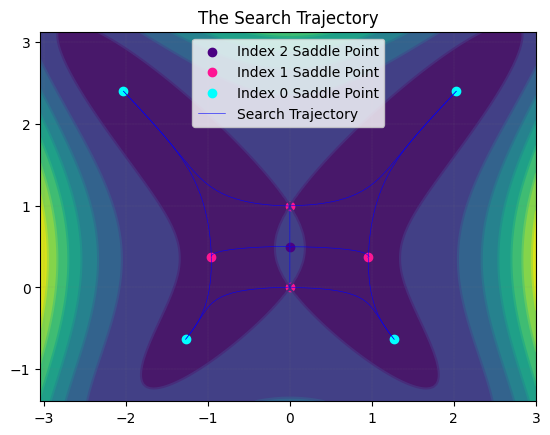
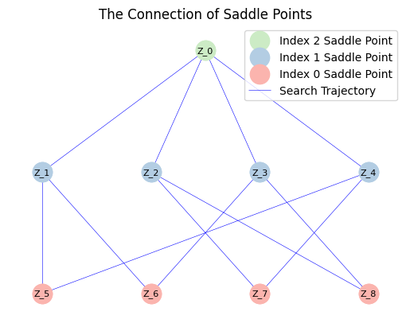

We test the example whose heatmap resembles a butterfly shape and the energy function is shown by 
\begin{aligned}
E(x,y)=x^{4}-1.5x^{2}y^{2}+y^{4}-2y^{3}+y^{2}+x^{2}y-2x^{2}.
\end{aligned}

First, we add the path of the `solscape-1.0` directory to the system path.


```python
import sys
import os

sys.path.append(os.path.abspath(os.path.join(os.getcwd(), '..', 'solscape-1.0')))
```

Then, we import the main class.


```python
from solscape import Landscape
import numpy as np
# import packages needed
```

We define the energy function.


```python
energyfunction = 'x1**4 -1.5*x1**2*x2**2+ x2**4 - 2*x2**3 + x2**2 + x1**2*x2 - 2*x1**2' 
# given energy function
```


```python
# parameter initialization
x0 = np.array([0.1, 0.1]) # initial point
dt = 1e-2 # time step
k = 2 # the maximum index of saddle point
acceme = 'none'
maxiter = 10000 # max iter
```

We initialize the solver and run it.


```python
MyLandscape = Landscape(MaxIndex=k, AutoGrad=True, EnergyFunction=energyfunction, 
                        EigenMethod='euler', EigenMaxIter=1, InitialPoint=x0, 
                        TimeStep=dt, Acceleration=acceme, MaxIter=maxiter, 
                        EigenCombination='all', PerturbationNumber=1, 
                        PerturbationRadius=1e-2, Verbose=True, ReportInterval=100)
# Instantiation
MyLandscape.Run()
# Calculate
```

    HiSD Solver Configuration:
    ------------------------------
    [HiSD] Current parameters (initialized):
    [Config Sync] `Dim` parameter auto-adjusted to 2 based on `InitialPoint` dimensionality.
    Parameter `NumericalGrad` not specified - using default value False.
    Using `EnergyFunction` instead of `Grad` - enabling auto-differentiation mode.
    Parameter `Momentum` not specified - using default value 0.0.
    Parameter `BBStep` not specified - using default value False.
    Parameter `DimerLength` not specified - using default value 1e-05.
    Parameter `Tolerance` not specified - using default value 1e-06.
    Parameter `NesterovChoice` not specified - using default value 1.
    Parameter `SearchArea` not specified - using default value 1000.0.
    Parameter `NesterovRestart` not specified - using default value None.
    Parameter `HessianDimerLength` not specified - using default value 1e-05.
    Parameter `EigenStepSize` not specified - using default value 1e-05.
    Parameter `ExactHessian` not specified - using default value False.
    Parameter `PrecisionTol` not specified - using default value 1e-05.
    Parameter 'GradientSystem' not provided. Enabling automatic symmetry detection.
    Parameter 'SymmetryCheck' not provided. Defaulting to True with automatic detection.
    
    
    Gradient system detected. Activating HiOSD algorithm.
    
    
    Landscape Configuration:
    ------------------------------
    [Landscape] Current parameters (initialized):
    Parameter `SameJudgementMethod` not specified - using default value <function LandscapeCheckParam.<locals>.<lambda> at 0x000002EBD1A2F240>.
    Parameter `PerturbationMethod` not specified - using default value uniform.
    Parameter `InitialEigenVectors` not specified - using default value None.
    Parameter `SaveTrajectory` not specified - using default value True.
    Parameter `MaxIndexGap` not specified - using default value 1.
    
    
    Start running:
    ------------------------------
    
    
    
    
    From initial point search index-2:
    ------------------------------
    
    
    Iteration: 100|| Norm of gradient: 0.176823
    Iteration: 200|| Norm of gradient: 0.084819
    Iteration: 300|| Norm of gradient: 0.032330
    Iteration: 400|| Norm of gradient: 0.011899
    Iteration: 500|| Norm of gradient: 0.004359
    Iteration: 600|| Norm of gradient: 0.001596
    Iteration: 700|| Norm of gradient: 0.000584
    Iteration: 800|| Norm of gradient: 0.000214
    Iteration: 900|| Norm of gradient: 0.000078
    Iteration: 1000|| Norm of gradient: 0.000029
    Iteration: 1100|| Norm of gradient: 0.000010
    Iteration: 1200|| Norm of gradient: 0.000004
    Iteration: 1300|| Norm of gradient: 0.000001
    Non-degenerate saddle point identified: Morse index =2 (number of negative eigenvalues).
    
    
    From saddle point (index-2, ID-0) search index-1:
    ------------------------------
    
    
    Iteration: 100|| Norm of gradient: 0.023111
    Iteration: 200|| Norm of gradient: 0.061258
    Iteration: 300|| Norm of gradient: 0.144118
    Iteration: 400|| Norm of gradient: 0.183221
    Iteration: 500|| Norm of gradient: 0.063280
    Iteration: 600|| Norm of gradient: 0.010152
    Iteration: 700|| Norm of gradient: 0.001384
    Iteration: 800|| Norm of gradient: 0.000184
    Iteration: 900|| Norm of gradient: 0.000024
    Iteration: 1000|| Norm of gradient: 0.000003
    Non-degenerate saddle point identified: Morse index =1 (number of negative eigenvalues).
    
    
    From saddle point (index-2, ID-0) search index-1:
    ------------------------------
    
    
    Iteration: 100|| Norm of gradient: 0.023108
    Iteration: 200|| Norm of gradient: 0.061250
    Iteration: 300|| Norm of gradient: 0.144105
    Iteration: 400|| Norm of gradient: 0.183230
    Iteration: 500|| Norm of gradient: 0.063294
    Iteration: 600|| Norm of gradient: 0.010155
    Iteration: 700|| Norm of gradient: 0.001384
    Iteration: 800|| Norm of gradient: 0.000184
    Iteration: 900|| Norm of gradient: 0.000024
    Iteration: 1000|| Norm of gradient: 0.000003
    Non-degenerate saddle point identified: Morse index =1 (number of negative eigenvalues).
    
    
    From saddle point (index-2, ID-0) search index-1:
    ------------------------------
    
    
    Iteration: 100|| Norm of gradient: 0.069550
    Iteration: 200|| Norm of gradient: 1.384067
    Iteration: 300|| Norm of gradient: 0.016423
    Iteration: 400|| Norm of gradient: 0.000428
    Iteration: 500|| Norm of gradient: 0.000011
    Non-degenerate saddle point identified: Morse index =1 (number of negative eigenvalues).
    
    
    From saddle point (index-2, ID-0) search index-1:
    ------------------------------
    
    
    Iteration: 100|| Norm of gradient: 0.070554
    Iteration: 200|| Norm of gradient: 1.382590
    Iteration: 300|| Norm of gradient: 0.016414
    Iteration: 400|| Norm of gradient: 0.000428
    Iteration: 500|| Norm of gradient: 0.000011
    Non-degenerate saddle point identified: Morse index =1 (number of negative eigenvalues).
    
    
    From saddle point (index-1, ID-1) search index-0:
    ------------------------------
    
    
    Iteration: 100|| Norm of gradient: 2.756656
    Iteration: 200|| Norm of gradient: 0.097628
    Iteration: 300|| Norm of gradient: 0.000156
    Non-degenerate saddle point identified: Morse index =0 (number of negative eigenvalues).
    
    
    From saddle point (index-1, ID-1) search index-0:
    ------------------------------
    
    
    Iteration: 100|| Norm of gradient: 2.764937
    Iteration: 200|| Norm of gradient: 0.095612
    Iteration: 300|| Norm of gradient: 0.000153
    Non-degenerate saddle point identified: Morse index =0 (number of negative eigenvalues).
    
    
    From saddle point (index-1, ID-2) search index-0:
    ------------------------------
    
    
    Iteration: 100|| Norm of gradient: 0.683724
    Iteration: 200|| Norm of gradient: 0.630702
    Iteration: 300|| Norm of gradient: 0.021770
    Iteration: 400|| Norm of gradient: 0.000515
    Iteration: 500|| Norm of gradient: 0.000012
    Non-degenerate saddle point identified: Morse index =0 (number of negative eigenvalues).
    
    
    From saddle point (index-1, ID-2) search index-0:
    ------------------------------
    
    
    Iteration: 100|| Norm of gradient: 0.694268
    Iteration: 200|| Norm of gradient: 0.622645
    Iteration: 300|| Norm of gradient: 0.021346
    Iteration: 400|| Norm of gradient: 0.000505
    Iteration: 500|| Norm of gradient: 0.000012
    Non-degenerate saddle point identified: Morse index =0 (number of negative eigenvalues).
    
    
    From saddle point (index-1, ID-3) search index-0:
    ------------------------------
    
    
    Iteration: 100|| Norm of gradient: 0.785689
    Iteration: 200|| Norm of gradient: 0.693273
    Iteration: 300|| Norm of gradient: 0.001260
    Iteration: 400|| Norm of gradient: 0.000002
    Non-degenerate saddle point identified: Morse index =0 (number of negative eigenvalues).
    
    
    From saddle point (index-1, ID-3) search index-0:
    ------------------------------
    
    
    Iteration: 100|| Norm of gradient: 0.554195
    Iteration: 200|| Norm of gradient: 0.361167
    Iteration: 300|| Norm of gradient: 0.010264
    Iteration: 400|| Norm of gradient: 0.000242
    Iteration: 500|| Norm of gradient: 0.000006
    Non-degenerate saddle point identified: Morse index =0 (number of negative eigenvalues).
    
    
    From saddle point (index-1, ID-4) search index-0:
    ------------------------------
    
    
    Iteration: 100|| Norm of gradient: 0.815094
    Iteration: 200|| Norm of gradient: 0.215346
    Iteration: 300|| Norm of gradient: 0.005622
    Iteration: 400|| Norm of gradient: 0.000132
    Iteration: 500|| Norm of gradient: 0.000003
    Non-degenerate saddle point identified: Morse index =0 (number of negative eigenvalues).
    
    
    From saddle point (index-1, ID-4) search index-0:
    ------------------------------
    
    
    Iteration: 100|| Norm of gradient: 1.425148
    Iteration: 200|| Norm of gradient: 0.275918
    Iteration: 300|| Norm of gradient: 0.000457
    Non-degenerate saddle point identified: Morse index =0 (number of negative eigenvalues).
    

We draw the search trajectory.


```python
MyLandscape.DrawTrajectory(ContourGridNum=100, ContourGridOut=25, DetailedTraj=True)
# Draw the search path.
```


    

    


We can also draw the solution landscape and save the data.


```python
MyLandscape.DrawConnection()
MyLandscape.Save('Ex_Butterfly')
# Save the data
```


    

    

